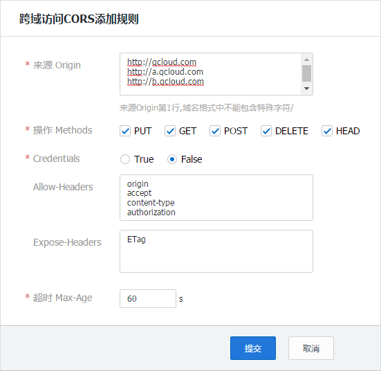

# cos-js-sdk-v4

腾讯云 COS JS SDK（[JSON API](https://www.qcloud.com/document/product/436/6052)）

[releases](https://github.com/tencentyun/cos-js-sdk-v4/releases)

## 前期准备

1. 使用SDK需要浏览器支持HTML 5<br>
2. 请您到https://console.qcloud.com/cos 获取您的项目ID(appid)，bucket，secret_id和secret_key。
3. 请您到https://console.qcloud.com/cos 针对您要操作的bucket进行跨域（CORS）设置，可以按照如下范例，修改来源 Origin：

    


## 配置

### Step1. 下载源码
从github下载源码，将SDK中dist目录下的cos-js-sdk-v4.js包含到您的项目中。

### Step.2 加载文件
在您的页面里引入cos-js-sdk-v4.js <br>

&lt;script type="text/javascript" src="cos-js-sdk-v4.js"&gt;&lt;/script&gt;<br>

## 使用

### cos-js-sdk之v4与v3相比的一些改动

1. v3没有地域信息，v4初始化的逻辑，必须指定地域信息，华南地区填gz 华东填sh 华北填tj
2. v3的auth.php耦合度太高，sha1值使用了flash计算，v4把鉴权的逻辑分离，可以自己实现getAppSign和getAppSignOnce， v4提供了完整的，浏览器端实现签名的示例，注意传给 SDK 的签名要做一次 url 编码
3. v3分了普通上传和分片上传接口，v4上传直接调用一个接口即可，大文件会自动调用分片逻辑（当然也可以手动调用分片上传）
4. v4新增了进度回调onprogress
5. v4进行了模块化封装，可以自行用gulp构建
6. 如何确定自己应该是用v4的sdk还是v3的？ 登陆https://console.qcloud.com/cos 如果左上角提示是云对象存储v4则说明要用v4的sdk否则就是v3的

### 可以通过 npm 引入打包依赖

```
npm i cos-js-sdk-v4 --save-dev
```

### 所有的示例代码实现可以参考sample/index.html

### 初始化

```js

	//初始化逻辑
	//特别注意: JS-SDK使用之前请先到console.qcloud.com/cos 对相应的Bucket进行跨域设置
	var cos = new CosCloud({
		appid: appid,// APPID 必填参数
		bucket: bucket,//bucketName 必填参数
		region: 'sh',//地域信息 必填参数 华南地区填gz 华东填sh 华北填tj
		getAppSign: function (callback) {//获取签名 必填参数

			//下面简单讲一下获取签名的几种办法

			//1.搭建一个鉴权服务器，自己构造请求参数获取签名，推荐实际线上业务使用，优点是安全性好，不会暴露自己的私钥
			//拿到签名之后记得调用callback
			/**
			 $.ajax('SIGN_URL').done(function (data) {
				var sig = data.sign;
				callback(sig);
			});
			 **/

			//2.直接在浏览器前端计算签名，需要获取自己的accessKey和secretKey, 一般在调试阶段使用
			//拿到签名之后记得调用callback
			//var res = getAuth(); //这个函数自己根据签名算法实现
			//callback(res);


			//3.直接复用别人算好的签名字符串, 一般在调试阶段使用
			//拿到签名之后记得调用callback
			//callback('YOUR_SIGN_STR')
			//

		},
		getAppSignOnce: function (callback) {//单次签名，必填参数，参考上面的注释即可
			//填上获取单次签名的逻辑
			// callback('YOUR_SIGN_STR')
		}
	});


```

### 上传程序示例

```js

	var myFolder = '/111/';//需要操作的目录
	var successCallBack = function (result) {
		$("#result").val(JSON.stringify(result));
	};

	var errorCallBack = function (result) {
		result = result || {};
		$("#result").val(result.responseText || 'error');
	};

	var progressCallBack = function(curr){
		$("#result").val('uploading... curr progress is '+curr);
	};

	$('#js-file').off('change').on('change', function (e) {
		var file = e.target.files[0];
		cos.uploadFile(successCallBack, errorCallBack, progressCallBack, bucket, myFolder+file.name, file, 0);
		return false;
	});


```

### 分片上传大文件程序示例

```js

	var myFolder = '/111/';//需要操作的目录
	var successCallBack = function (result) {
		$("#result").val(JSON.stringify(result));
	};

	var errorCallBack = function (result) {
		result = result || {};
		$("#result").val(result.responseText || 'error');
	};

	var progressCallBack = function(curr){
		//注意一下这里的进度，这里返回的是总的进度，而不是单个ajax的进度
		//例如文件是100M，ajax每次分片上传1M的数据，目前传了500K，则进度应该是
		// 500K/100M == 0.05
		$("#result").val('uploading... curr progress is '+curr);
	};

	$('#js-file').off('change').on('change', function (e) {
		var file = e.target.files[0];
		//分片上传也直接调用uploadFile方法，内部会判断是否需要分片
		cos.uploadFile(successCallBack, errorCallBack, progressCallBack, bucket, myFolder+file.name, file, 0);
		return false;
	});


```

### 创建文件夹示例

```js

	$('#createFolder').on('click', function () {
		var newFolder = '/333/';//填你需要创建的文件夹，记得用斜杠包一下
		cos.createFolder(successCallBack, errorCallBack, bucket, newFolder);
	});


```


### 删除文件夹示例

```js

	//删除文件夹
	$('#deleteFolder').on('click', function () {
		var newFolder = '/333/';//填你需要删除的文件夹，记得用斜杠包一下
		cos.deleteFolder(successCallBack, errorCallBack, bucket, newFolder);
	});


```


### 获取文件夹内列表示例

```js

	//获取指定文件夹内的列表,默认每次返回20条
	$('#getFolderList').on('click', function () {
		cos.getFolderList(successCallBack, errorCallBack, bucket, myFolder);
	});


```


### 获取文件夹属性示例

```js

	//获取文件夹属性
	$('#getFolderStat').on('click', function () {
		cos.getFolderStat(successCallBack, errorCallBack, bucket, '/333/');
	});


```


### 更新文件夹属性示例

```js

	//更新文件夹属性
	$('#updateFolder').on('click', function () {
		cos.updateFolder(successCallBack, errorCallBack, bucket, '/333/', 'new attr');
	});

```

### 删除文件示例

```js

	//删除文件
	$('#deleteFile').on('click', function () {
		var myFile = myFolder+'2.txt';//填你自己实际存在的文件
		cos.deleteFile(successCallBack, errorCallBack, bucket, myFile);
	});

```

### 获取文件属性示例

```js

	//获取文件属性
	$('#getFileStat').on('click', function () {
		var myFile = myFolder+'2.txt';//填你自己实际存在的文件
		cos.getFileStat(successCallBack, errorCallBack, bucket, myFile);
	});

```

### 更新文件属性示例

```js

	//更新文件属性
	$('#updateFile').on('click', function () {
		var myFile = myFolder+'2.txt';//填你自己实际存在的文件
		cos.updateFile(successCallBack, errorCallBack, bucket, myFile, 'my new file attr');
	});

```

### 拷贝文件示例

```js

	//拷贝文件，从源文件地址复制一份到新地址
	$('#copyFile').on('click', function () {

		var myFile = '111/2.txt';//填你自己实际存在的文件

		//注意一下目标的路径，这里如果填333/2.txt 则表示文件复制到111/333/2.txt
		//如果填/333/2.txt 则表示文件复制到bucket根目录下的333/2.txt
		var newFile = '/333/2.txt';
		var overWrite = 1;//0 表示不覆盖 1表示覆盖
		cos.copyFile(successCallBack, errorCallBack, bucket, myFile, newFile, overWrite);
	});

```

### 移动文件示例

```js

	//移动文件，把源文件移动到新地址，如果是同一个目录移动且文件名不同的话，相当于改了一个文件名
	//如果是移动到新目录，相当于剪切当前的文件，粘贴到了新目录
	$('#moveFile').on('click', function () {

		var myFile = '/111/2.txt';//填你自己实际存在的文件

		//注意一下目标的路径，这里如果填333/2.txt 则表示文件移动到111/333/2.txt
		//如果填/333/2.txt 则表示文件移动到bucket根目录下的333/2.txt
		//如果填/111/3.txt 则相当于把2.txt改名成3.txt
		var newFile = '/333/2.txt';
		var overWrite = 1;//0 表示不覆盖 1表示覆盖
		cos.moveFile(successCallBack, errorCallBack, bucket, myFile, newFile, overWrite);
	});

```

## 反馈

欢迎提issue
